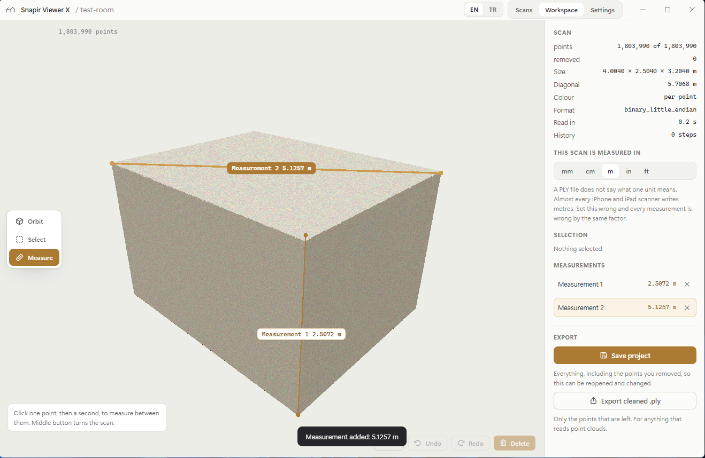
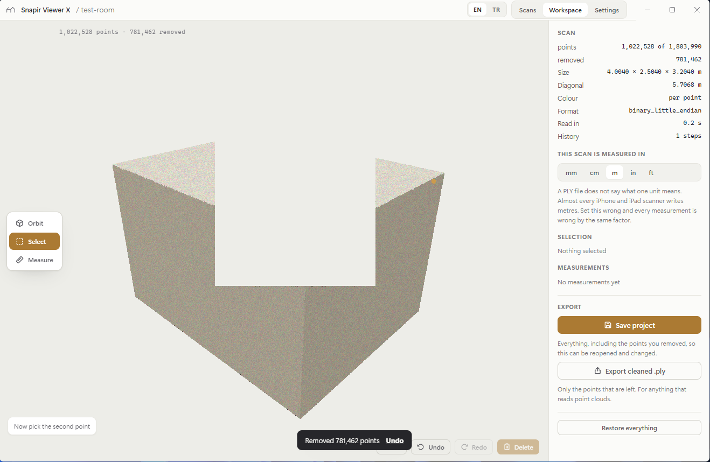
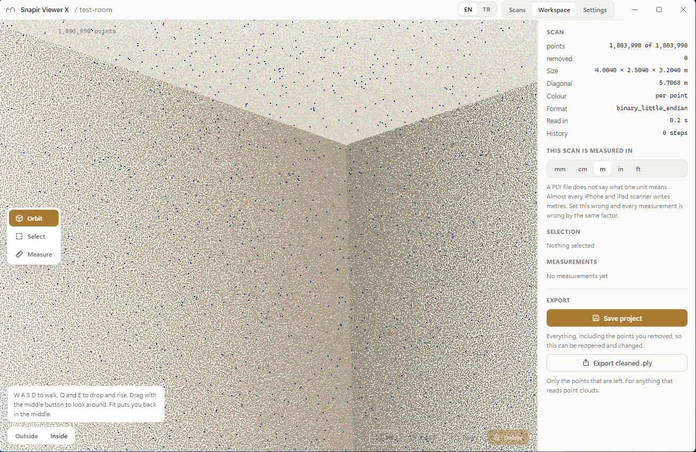

# Snapir Viewer X

[](https://github.com/SeventhSG/SnapirViewerX/releases/latest)
[](https://github.com/SeventhSG/SnapirViewerX/releases/latest)
[](https://github.com/SeventhSG/SnapirViewerX/releases/latest)
[](app/tools/selftest.ts)
[](#your-scan-stays-on-your-machine)

**Full-colour LiDAR scans from an iPhone or iPad, cleaned and measured on a
desktop.** Open the scan, cut away what is not the building, measure what is,
and hand the result on as a project file or a clean point cloud.



---

## What it is for

A phone scan of a room arrives with everything the phone could see in it: the
person holding it, the van through the window, the reflection in the mirror,
the ceiling of the room next door caught through an open doorway. None of that
is the building, and all of it is in the way of measuring the building.

Snapir Viewer X is the step between the scanning app and whatever you do next.
It does four things and nothing else.

| | |
|---|---|
| **Open** | A `.ply` point cloud with colour, straight out of the scanning app |
| **Cut** | Drag a rectangle, everything inside it goes, `Ctrl+Z` brings it back |
| **Measure** | Two points, a line, a length, in whichever unit you work in |
| **Hand on** | A `.svxp` project to come back to, or a cleaned `.ply` for anything else |

---

## The four things, in detail

### Open

Reads `.ply` in all three encodings the format defines: `ascii`,
`binary_little_endian` and `binary_big_endian`. Colour is found whether the
file calls it `red green blue`, `r g b` or `diffuse_red diffuse_green
diffuse_blue`, and a file with only an intensity channel is read as greyscale.

Three things that are usually someone else's problem are handled here:

- **A mesh exported as `.ply`** opens as the point cloud inside it. The face
  data is stepped over rather than rejected.
- **A Gaussian splat `.ply`**, which stores colour as spherical harmonics and
  has no `red` property anywhere, opens in colour rather than grey.
- **A scan sitting at a survey coordinate** keeps its precision. Coordinates
  are measured from a local origin, so a cloud at 4,500,000 is not quantised
  to 30 cm by float rounding, which is what happens when a reader stores raw
  coordinates as float32.

A truncated file, a text file renamed to `.ply`, and a scan larger than the
machine can hold each say so in a sentence.

### Cut

The **Select** tool drags a rectangle. Everything inside the rectangle goes,
including what is behind what you can see: the rectangle is a prism through
the whole scan, not a test against the visible surface. Cutting a person out
of a room should not need one pass from the front and another from the back.

- `Shift` while dragging adds to the selection, `Alt` takes away
- `Delete` removes the selection, **Keep only these** removes everything else
- `Ctrl+Z` and `Ctrl+Y`, as deep as the session goes
- **Restore everything** puts the whole scan back



*A rectangle dragged over the scan cuts a prism through all of it, near wall
and far wall together. 781,462 points, and `Ctrl+Z` puts every one of them
back.*

Nothing is destroyed until you export. Deleting sets a flag on a point rather
than rewriting the cloud, which is why undo is instant on twenty million
points and why a project saved halfway through a clean can still be taken
apart a year later.

### Measure

Two clicks, a gold line, a length, and a label you can rename. The length
follows the unit you work in, and changing that unit changes no geometry.

Picking finds the nearest surface under the cursor and then takes the point
you actually pointed at on it. Both halves matter. Without the first, a
measurement silently snaps through a wall to the room behind; without the
second, every pick drifts inward by the pick radius and a room measures short
by a few centimetres with nothing on screen to show it.

### Hand on

| Format | What it holds | Use it for |
|---|---|---|
| **`.svxp`** | The whole scan, the cut list, the measurements, the view | Coming back to the job, or moving it to another machine |
| **`.ply`** | Only the points that are left, binary, with colour | Anything that reads point clouds |

A `.svxp` keeps the points you deleted, so it does not shrink as you clean.
That is the point of it: the cut is a decision you can revisit. Exporting
`.ply` is what produces a file with the deleted points actually gone.
See **[docs/SVXP.md](docs/SVXP.md)** for the full specification.

---

## Units

A PLY file does not record what one unit means. Nothing in the format can hold
it, and no scanning app writes it anywhere else. So the viewer keeps two
numbers apart and never confuses them:

- **The source unit** is a property of the scan: what one unit in the file
  means. Set this wrong and every measurement is wrong by the same factor.
  Almost every iPhone and iPad scanner writes metres, which is the default.
- **The display unit** is a preference: mm, cm, m, inches or feet. Changing it
  changes nothing in the scan.

Both are on screen, and the source unit sits in the inspector next to the
measurements it governs rather than buried in a settings page.

---

## Controls

The navigation is Geomagic Design X's, because that is what the hands of
anyone using this already know. The left button always belongs to the active
tool; the middle button always moves the view.

| | |
|---|---|
| **Middle drag** | Turn the scan, in any tool |
| **Ctrl + middle drag** | Pan |
| **Wheel** | Zoom |
| **Left drag** | Whatever the tool does. With no tool running, it turns the scan too |
| **Right drag** | Pan |

### Standing in the scan



**Inside** puts the eye in the middle of the scan, 1.6 m above the floor, and
lets you walk it. Same speed and same keys as walking a solved room in Snapir
Design X.

| | |
|---|---|
| `W` `A` `S` `D` | Walk |
| `Q` `E` | Drop and rise |
| **Middle drag** | Look around |
| **Fit** | Back to the middle of the room |

Selecting and measuring both work from in there.

### Keyboard

| | |
|---|---|
| `1` `2` `3` | Orbit, Select, Measure |
| `F` | Fit |
| `Delete` | Remove the selection |
| `Ctrl+Z` / `Ctrl+Y` | Undo, redo |
| `Ctrl+A` / `Ctrl+I` | Select all, invert |
| `Ctrl+S` | Save project |
| `Esc` | Clear the selection, or abandon a half-finished measurement |

---

## Capturing the scan

On the phone, **[Scaniverse](https://scaniverse.com/)** is the one to reach
for: free, no watermark, no paywall on export, and its LiDAR mode writes a
colour point cloud in metres. Export as **Point Cloud (PLY)**.

Polycam and 3D Scanner App both capture well, but PLY export is a paid feature
in each. Free tiers change, so the App Store listing is the authority, not
this page.

Any of them needs a device with LiDAR: an iPhone 12 Pro or newer Pro and Pro
Max, or an iPad Pro from 2020 on.

---

## Your scan stays on your machine

There is no account, no upload, no telemetry and no backend. The file is read
off the disk into this process and everything after that happens there. The
only network call the application ever makes is the update check against this
repository's releases page, and it does not send your scan.

The window enforces this rather than promising it: the page runs under a
Content Security Policy that permits `self` and nothing else, so there is no
origin it could reach even if something tried.

---

## Install

Download **`SnapirViewerX-0.1.0-setup.exe`** from
**[the latest release](https://github.com/SeventhSG/SnapirViewerX/releases/latest)**
and run it. Windows 10 or 11, 64-bit.

The installer is not code-signed, so SmartScreen will show **Windows protected
your PC** on first run. **More info**, then **Run anyway**. Signing means an
EV certificate and an annual fee, and this build has not paid it.

Once installed, `.svxp` and `.ply` open by double-clicking, and the app
updates itself from this repository's releases in the background.

### How big a scan it will take

The whole cloud is held in memory and drawn in one call, with no streaming and
no level of detail. On an ordinary machine that is comfortable to about
**20 million points**, which is a large flat. Beyond that it will still open
if the memory is there, but it stops being pleasant to turn.

A 1.8 million point scan reads in about 0.2 seconds.

---

## Build it yourself

```bash
cd app
npm install
npm run dev        # the app, with the interface hot-reloading
npm test           # 56 checks, no window needed
npm run typecheck
npm run dist       # the Windows installer, into app/release
```

Node 18 or newer. The installer step needs nothing else: there is no native
code and no Python.

The interface deliberately assumes nothing about Electron. Every call into the
machine goes through one nine-method bridge in
[`app/src/shell.ts`](app/src/shell.ts), with a browser implementation beside
it, so the same interface can be put in an Android WebView or an iOS
WKWebView with a shell around it and nothing above that file changed. The
stylesheet already carries the safe-area insets and the touch sizing for it.

---

## What is inside

| | |
|---|---|
| [`app/src/ply.ts`](app/src/ply.ts) | The PLY reader and writer |
| [`app/src/cloud.ts`](app/src/cloud.ts) | The scan, selection, undo, picking |
| [`app/src/svxp.ts`](app/src/svxp.ts) | The project format |
| [`app/src/Viewport.tsx`](app/src/Viewport.tsx) | The renderer, the marquee, standing inside |
| [`app/src/shell.ts`](app/src/shell.ts) | The one seam between the interface and the machine |
| [`app/tools/selftest.ts`](app/tools/selftest.ts) | The checks that do not need a window |

The reader, the editing model and the project format are checked against a
room built to a known size, so "4.000 m across" is asserted rather than
eyeballed. `npm test` builds the fixture from a fixed seed and runs 56 checks
over it, including that a measurement across the room comes back at 4.000 m to
within a tenth of a millimetre, that a truncated file is refused, and that a
project survives a save and reopen with its cut list intact.

---

## Status

**0.1.0, the first release.** Working end to end on synthetic scans and on
phone captures: open, cut, undo, measure, export, reopen.

Known limits, stated rather than left to be discovered:

- **PLY only.** No LAS, LAZ or E57 yet.
- **No streaming.** See the note on size above.
- **The installer is unsigned.** See the note on SmartScreen above.
- **Windows only** is what is built and tested. Nothing in the interface is
  Windows-specific, and the bridge exists so that iOS and Android shells can
  follow, but neither has been built.

---

Snapir Design X and Snapir Viewer X are by **[SeventhSG](https://github.com/SeventhSG)**.
